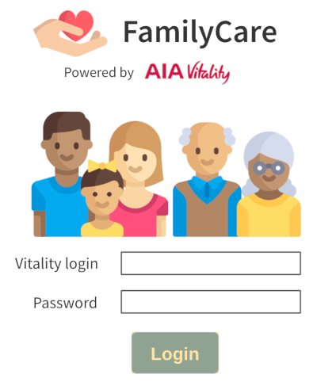
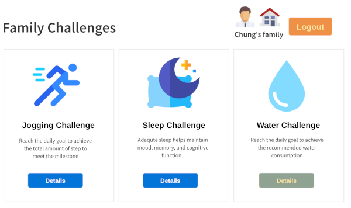
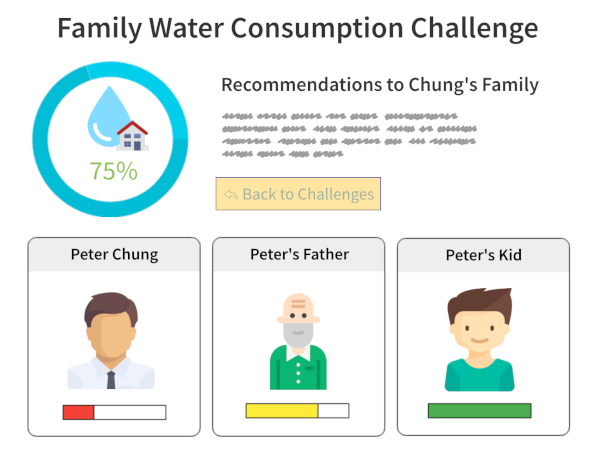

The code repository for AIA Life Hack 2018 #AIALIFEHACK18

# Storyline

I am a AIA customer for more than 10 years. When my mother got stroke 2 years ago, I evaluated her medical history, and found out that she didn't buy any insurance product.

## Problem Statement

In AIA Life Hack 2018, we would like raise awareness of family protection. 

## Proposed Solution

We would like to use **Gamification** approach to improve **customer engagement** from personal level to family level. 

## Potential Benefits

The potential benefits are:
- **Bring** healthier life to the customers and their core family members
- **Reach** out more potential customers

## Wireframes

**Wireframe 1:  Login Screen**

**Wireframe 2:  Family-based challenges**

**Wireframe 3: Details of the family-based challenge**

## Team members
- Peter Chung (UI/UX)
    - Participated/joined more than 30 Hackathons in Hong Kong
    - Used to have a health-tech startup project at Cyberport 2 years ago
- Colin Wong (Design thinker)
    - Worked as an insurance broker for nearly 8 years
    - Co-founded an InsurTech startup for nearly 2 years
- Cavour, Iu Yan Poon (Business and Software Developer)
    - Worked in the insurance tech industry for around 3 years 
- Timonthy Ng (Software Developer and Data Scientist)
- Keith Ng (Designer)
- Nathan Hui (Business)
    - A health-tech startup co-founder

## Other stuff
- [Basic Data Analysis on the AIA Vitality Dataset](aia_vitality_data_analsysi.md)
- [Discussion on Friday night](friday-discussion.md)