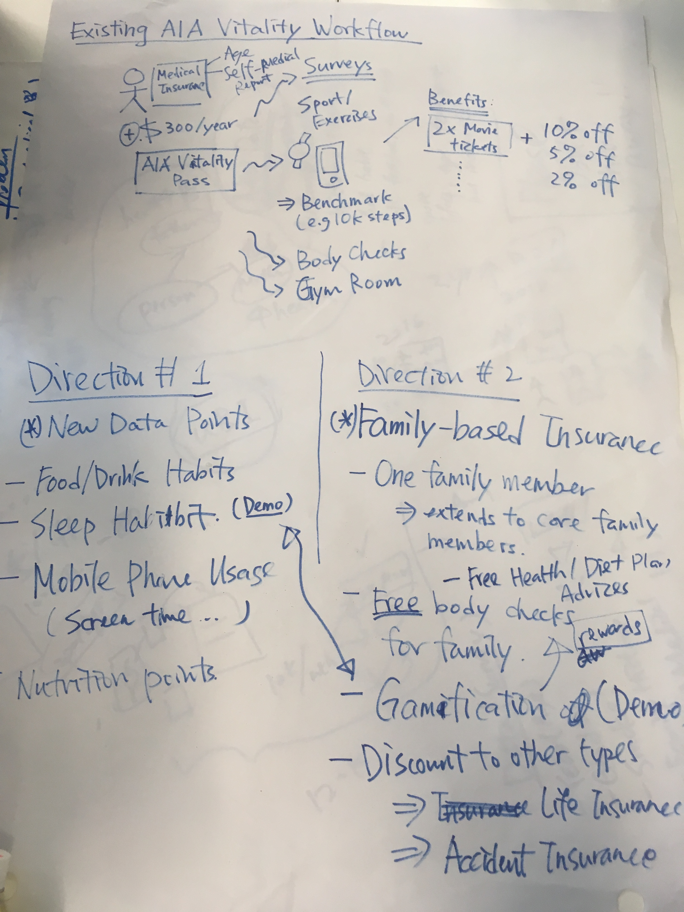

The code repository for AIA Life Hack 2018 #AIALIFEHACK18

# Storyline

I am a AIA customer for more than 10 years. When my mother got stroke 2 years ago, I evaluated her medical history, and found out that she didn't buy any insurance product, and was not awared of her insurance coverage. 

# Problem Statement

New customers have difficulties to understand insurance products, and have no immediate needs to buy insurance products. 

Existing customers may receive insurance coverage in a personal level. Family members contribute a major part of a person's life. However, it is unable to relate to his/her core family members.

*Note: We need to validate it from the customer's Q and A*

# Proposed Solution

We would like to improve **customer engagement** by extending AIA Vitality from personal level to family level. 

# Potential Benefits

The potential benefits are:
- **Bring** healthier life to the customers and their core family members
- **Reach** out more potential customers

# Team members
- Peter Chung (UI/UX)
    - Participated/joined more than 30 Hackathons in Hong Kong
    - Used to have a health-tech startup project at Cyberport 2 years ago
- Colin Wong (Design thinker)
    - Worked as an insurance broker for nearly 8 years
    - Co-founded an InsurTech startup for nearly 2 years
- Cavour, Iu Yan Poon (Business and Software Developer)
    - Worked in the insurance tech industry for around 3 years 
- Timonthy Ng (Software Developer and Data Scientist)
- Keith Ng (Designer)
- Nathan Hui (Business)
    - A health-tech startup co-founder

# Discussion on Friday night

## Key points we discussed

We aim to improve AIA Vitality ecosystem in the following 2 main directions

- Family-based Data Analysis and Visualization
    - One family member encouages/extends to other family members
    - Idea: Family games to engage more family members (e.g. father/mother/kids)
    - Incentives
        - Free wearable devices for family
        - Free body checks for family
- New Data Points Collection via Wearable Devices
    - Possible data points
        - Food/drink habit
        - Personalized sleep pattern
        - Mobile phone screen usage
        - Nutrition intakes everyday
    - Vitality records "number of steps" to evaluate how healthy a person is 
    - Modern wearable devices (e.g. Apple Watch / FitBit) can record more data from users

## Long-term Goals
- Usage-Based Insurance (UBI)
- Reduce the abuse of medical insurance reimbursement 

## Mind-Map / Discussion Map Created on Friday Night

